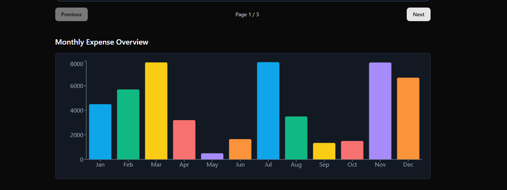
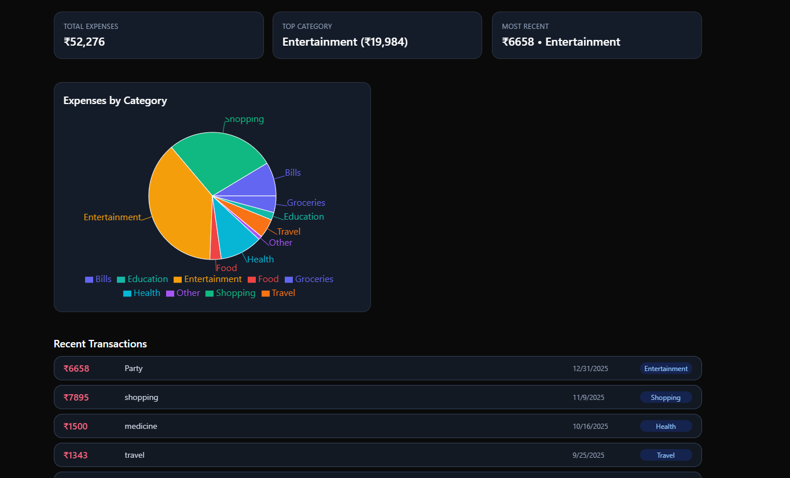

# 💸 Personal Finance Visualizer

A sleek and responsive web application to **track personal expenses**, **visualize spending**, and gain basic **financial insights** — built using **React**, **Express.js**, **MongoDB**, `shadcn/ui`, and `Recharts`.

---

## 🖼️ Preview
HOME PAGE
  
DASHBOARD PAGE

---

## 🚀 Live Demo

Frontend: [https://your-frontend.vercel.app](https://your-frontend.vercel.app)  
Backend: [https://your-backend.onrender.com](https://your-backend.onrender.com)

---

## 🛠️ Tech Stack

| Layer       | Tech Used                                      |
|-------------|------------------------------------------------|
| Frontend    | React + Vite + Tailwind CSS + shadcn/ui + Recharts |
| Backend     | Express.js + MongoDB + Mongoose                |
| API Client  | Axios                                          |
| Deployment  | Vercel (Frontend) + Render (Backend)           |

---

##  Features

### ✅ Stage 1: Basic Transaction Tracking

- Add / Edit / Delete transactions
- Monthly expenses bar chart
- Form validations

### ✅ Stage 2: Categories & Dashboard

- Predefined categories
- Category-wise pie chart
- Dashboard cards:
  - Total expense
  - Top category
  - Most recent transactions
- Fully responsive

---

## 🔧 Setup Instructions

### 1️⃣ Backend Setup (Render)
cd server
npm install
Create a .env file:

PORT=5000
MONGO_URI=your-mongodb-uri
Start server:
npm run dev
2️⃣ Frontend Setup (Vercel)
cd client
npm install
Create .env:
VITE_BASE_URL=your_url
Start client:

npm run dev
